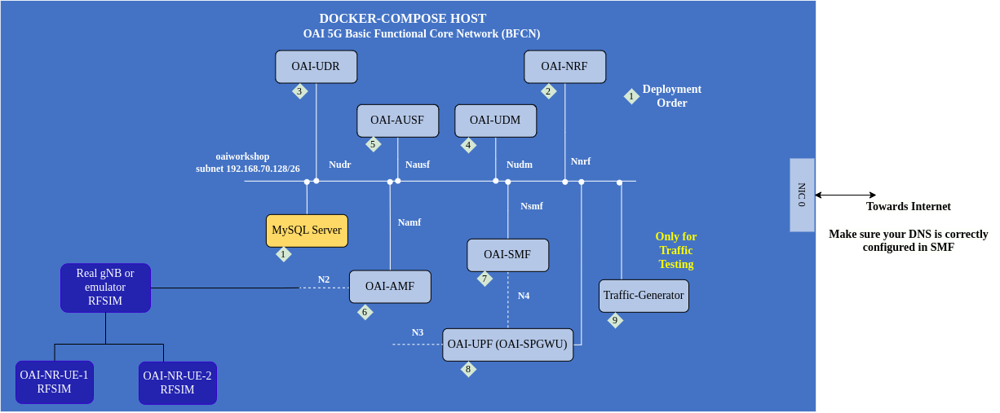
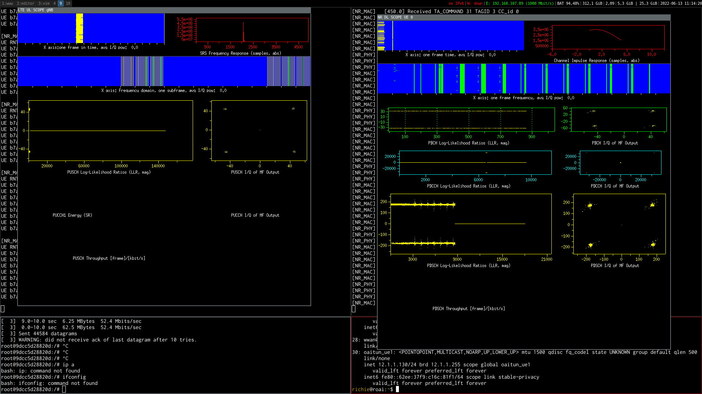
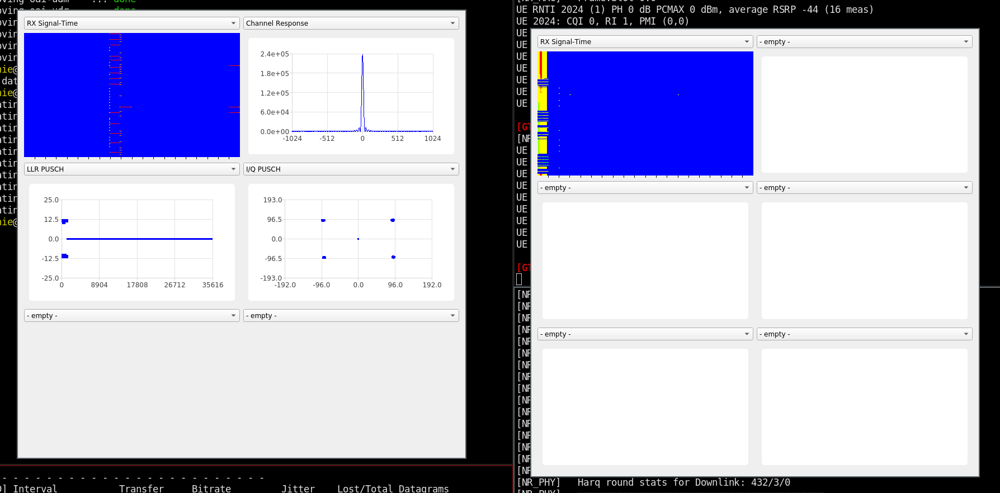
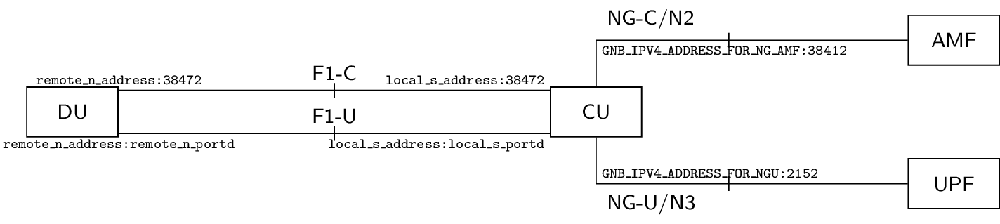
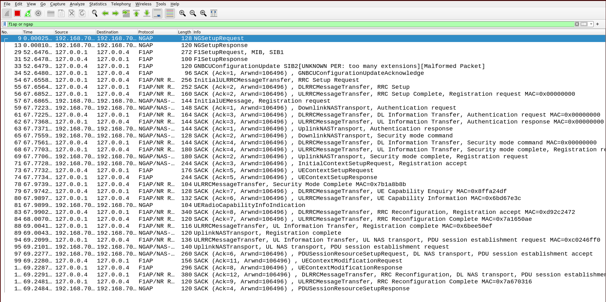

# Cellular Assignment

In this assignment, we will use OpenAirInterface (www.openairinterface.org) to instantiate a softwarized cellular network on Colosseum and exchange traffic between the base station and the user(s).

The goal of the assignment is to run an experiment with the OAI core, the OAI gNB and the OAI UE and to collect a wireshark trace of a successfull connection procedure (NGAP protocol).

The aim of this tutorial is to:

1. Set-up of end-to-end 5G/NR SA setup on Colosseum 
2. Learn about different OAI repositories
2. Learn how to deploy the Core Network 
3. Understand the RAN code repository organization
4. How to compile the RAN
5. Use of the scope(s) 
6. DU-CU/F1 split
7. FlexRIC

Note: this file can be converted to a presentation using

```
pandoc -t slidy --template ran.slidy -s README.md -o README.html
```

---

**TABLE OF CONTENTS**

[[_TOC_]]

---


# Deploying OAI on Colosseum

There are ready-made images in Colosseum NAS which include OAI RAN and 5G Core Network. These images can be selected in the Colosseum reservation page under the `common` section. The images of interest are

 - RAN Image: `sakthi-oai-flexric`
 - Core-network Image: `sakthi-core-2024-tcpdump`

Make a reservation with `n+2` SRNs out of which one Core-network image and `n+1` RAN Images where `n` is the number of UEs in the test scenario.

When you make a reservation, please check the box Q1-Q2-Q3. This will guarantee that your nodes are synchronized.

Once the reservation is active, you can login to the SRNs. The user for both images is 'root' and the password is `pass`.

---

## Run OAI 5G Core-network
In SRN running `oai-5gcore-2024`
```
cd oai-cn5g
docker compose up -d
```
This should start all the required docker containers for running the core-network.

---

## Run OAI gNB
The image contains a python script to start the gNB and UE.
```
cd OAI-Colosseum
python3 ran.py -t donor -m sa
```
This will start the gNB process. If you get an error related to FPGA compatibility number mismatch, run the above command with `-f` option. This will flash the FPGA of the USRP with the version that matches your version of the UHD driver. This option is only needed once. The subsequent runs can be started without `-f`.

You can also add the `--numa` option to the script to improve real-time performance. In this case you first need to set the environment variable
```
export USRP_NUMA_NODE=1
python3 ran.py -t donor -m sa --numa
```

---

## Start RF Scenario
Now we need to tell the MCHEM (Massive CHannel EMulator) to set up a channel between all the nodes in the current reservation. This can be done from any of the SRNs in the reservation. The following command starts an RF scenario with 0 dB path loss. (Please note that losses due to hardware impairments are still present.)

`colosseumcli rf start -c 10011`

---

## Run OAI UE
Run the following commands.
```
cd OAI-Colosseum
python3 ran.py -t ue -m sa
```
If all goes well, the UE should connect to the gNB and the core network should have assigned an IP address to the UE. This can be verified by running `ifconfig` on the UE side and checking if the network interface named `oaitun_ue` has an IP assigned.

Sometimes the UE may continuously fail the Random Access (RA) procedure and not proceed beyond that point. If this happens, try changing the `timing_advance` value in the `106` PRB section of the `conf.json` file (increase or decrease in steps of 5).

---

## IP Traffic
Ping the core-network from UE using `ping 192.168.70.135 -I oaitun_ue`. If the ping is successful, it means that an end-to-end connection between the UE and the 5G core network has been established. 

The user can push more traffic over the RAN using tools such as `iperf3`, or equivalent.
On the core-network side, run `docker exec -it oai-ext-dn iperf3 -s`

### Downlink Traffic
On the UE side, run `iperf3 -c 192.168.70.135 -B <ip of oaitun_ue> -b 50M -u -R`

### Uplink Traffic
On the UE side, run `iperf3 -c 192.168.70.135 -B <ip of oaitun_ue> -b 15M -u`

---


# Technical Deep Dive




---

## The Core Network

* Access and Mobility Management Function (**[AMF](https://gitlab.eurecom.fr/oai/cn5g/oai-cn5g-amf)**)
* Authentication Server Management Function (**[AUSF](https://gitlab.eurecom.fr/oai/cn5g/oai-cn5g-ausf)**)
* Location Management Function (**LMF**)
* Network Exposure Function (**[NEF](https://gitlab.eurecom.fr/oai/cn5g/oai-cn5g-nef)**)
* Network Repository Function (**[NRF](https://gitlab.eurecom.fr/oai/cn5g/oai-cn5g-nrf)**)
* Network Slicing Selection Function (**[NSSF](https://gitlab.eurecom.fr/oai/cn5g/oai-cn5g-nssf)**)
* Network Data Analytics Function (**[NWDAF](https://gitlab.eurecom.fr/oai/cn5g/oai-cn5g-nwdaf)**)
* Policy Control Function (**[PCF](https://gitlab.eurecom.fr/oai/cn5g/oai-cn5g-pcf)**)
* Session Management Function (**[SMF](https://gitlab.eurecom.fr/oai/cn5g/oai-cn5g-smf)**)
* Unified Data Management (**[UDM](https://gitlab.eurecom.fr/oai/cn5g/oai-cn5g-udm)**)
* Unified Data Repository (**[UDR](https://gitlab.eurecom.fr/oai/cn5g/oai-cn5g-udr)**)
* User Plane Function (**UPF**) with 2 variants:
  * Simple Implementation (with a eBPF option) (**[UPF](https://gitlab.eurecom.fr/oai/cn5g/oai-cn5g-upf)**)
  * VPP-Based Implementation (**[UPF-VPP](https://gitlab.eurecom.fr/oai/cn5g/oai-cn5g-upf-vpp)**)
* Unstructured Data Storage Function (**UDSF**)


---

### Docker images

Docker images of all OAI repositories are hosted on https://hub.docker.com/orgs/oaisoftwarealliance/.

The OAI CI/CD team has automated more frequent pushes to Docker-Hub on `oaisoftwarealliance` account. Two important things to be noted:

- We will keep pushing to the `latest` tag when a milestone is reached. 
- We are making pushes on the `develop` tag whenever a contribution has been accepted. These images are **EXPERIMENTAL**.
- Release tag `vx.x.x` contains the release code

---

###  Configuring the OAI-5G Core Network Functions

Since `v2.0.0` release of the 5G Core Network, the deployment files have been simplified:

1. The [docker-compose](./docker-compose.yml) file has containers/images related parameters:
  * Which version of the images to use
  * Name and IP addresses of the containers
2. The [config.yaml](./conf/config.yaml) file has the real network configuration parameters such as:
  * PLMN / Slices
  * DNN
  * ...

### Analyzing core network traffic with wireshark or tshark

We can analyze the messages between the core network components and between the RAN and the core with wireshark (graphical interface) or tshark (command line interface)

After starting the core network you will see a docker bridge network named "demo-oai-public-net" and a local netowkr interface named "demo-oai". 

- With Wireshark, select interface "demo-oai" with capture filter `sctp` and dispay filter `ngap`

- With tshark type: tshark -i demo-oai -f sctp -w oai.pcap

- You will need to copy this file to your local machine using scp and then you can analyze it with wireshark there. 

---


## The RAN repository

- `https://gitlab.eurecom.fr/oai/openairinterface5g`
- Work happens in the `develop` branch
- Usually one integration branch per week, tagged in the format `YYYY-wWW`, e.g., `2024.w12`
- `master` for a known stable version - release v2.0.0
- latest release: `v2.1.0` (February 2024)

---	 

### RAN Repository structure

- `openair1`: Layer 1 (3GPP LTE Rel-10/12 PHY, NR Rel-15 PHY)
- `openair2`: Layer 2 (3GPP LTE Rel-10 MAC/RLC/PDCP/RRC/X2AP, NR Rel-15+ MAC/RLC/PDCP/SDAP/RRC/X2AP/F1AP/E1AP), E2AP!
- `openair3`: Layer 3 (3GPP LTE Rel-10 S1AP/GTP)
- `charts`/`docker`/`openshift`: for building images
- `ci-scripts`: everything related to continuous integration/testing, configuration files
- `cmake_targets`: everything related to compilation, build artifacts in `ran_build/build`
- `common`: common code, generic libraries (Tpool, logging, configuration modules, \dots)
- `doc`: some documentation
- `executables`: LTE and NR executables
- `nfapi`: (n)FAPI split
- `radio`: radios and SDRs
- `targets`: configuration files (`PROJECTS`)

- Deep dive:
  - Where is NR PDSCH modulation? Called in `nr_generate_pdsch()`
  - Where is the NR PDSCH/DLSCH scheduler? See `gNB_dlsch_ulsch_scheduler()`
  - Where is the NR RRC Reconfiguration message sent? See `rrc_gNB_generate_dedicatedRRCReconfiguration()`
  - Where is the PDSCH simulation? See `dlschsim.c`
  - Where is the E2 agent? -> next training

---


### Installation of dependencies and compilation (not needed for this tutorial)

If you start from a fresh image you need first get the source code, install the RAN dependencies and compile OAI.

```
cd
git clone https://gitlab.eurecom.fr/oai/openairinterface5g.git
cd openairinterface5g/cmake_targets
git checkout 2024.w15                        # tested tag
./build_oai --ninja -I                       # install dependencies 
./build_oai --ninja --gNB --nrUE -w USRP -c  # compile gNB and nrUE
```


---

### How to build

If you make changes to the code you will need to recompile

- Use of the `build_oai` script
  - Is a wrapper for `cmake`
  - Some useful options: `-h`, `--eNB`, `--gNB`, `--UE`, `--nrUE`, `-c`, `--ninja`, `--sanitize-address`, `-g`, `-w`, `-P`/`--physical_simulators`, ...
- By default, build artifacts are in `cmake_targets/ran_build/build` (`ran_build/` configurable, see `-d` switch)
- To rebuild more quickly, issue
  ```
  ninja nr-softmodem nr-uesoftmodem dfts ldpc params_libconfig coding rfsimulator
  ```
- Also interesting: `lte-softmodem`, `lte-uesoftmodem`


### A closer look at the config file

- Note: if an option is not given, a default is used (which might or might not
  prevent the gNB from starting)
- You can override many options on the command line. Example: `./nr-softmodem -O gnb.conf --MACRLCs.[0].dl_max_mcs 20`

#### `gNBs` section
- `plmn_list`: list of PLMNs, with MCC, MNC, and NSSAIs; needs to match CN config
- `tracking_area_code`: Tracking Area Code; needs to match CN
- `amf_ip_address.[0].ipv4`: IP address of AMF
- `NETWORK_INTERFACES.GNB_IPV4_ADDRESS_FOR_NG_AMF` and `NETWORK_INTERFACES.GNB_IPV4_ADDRESS_FOR_NGU`: IP address on which is the gNB
- `min_rxtxtime`: minimum feedback time (e.g., PDSCH to PUCCH), is 5 for OAI UE
  and 2 for commercial UE
- `absoluteFrequencySSB` and `dl_absoluteFrequencyPointA`: frequencies for synchronization signal block and "PointA", in ARFCN; [use a calculator instead of getting mad](http://sqimway.com/nr_refA.php)
- TDD configuration is in `nrofDownlinkSlots`, `nrofUplinkSlots`,
  `nrofDownlinkSymbols` and `nrofUplinkSymbols`

#### `MACRLCs` section

- `ulsch_max_frame_inactivity`: maximum number of frames until UE is scheduled
  automatically even without requesting it. Often at `0` or `1` for lower
  latency, but this is "artificial"
- `pusch_TargetSNRx10`, `pucch_TargetSNRx10`: target SNRs multiplied by ten for
  these channels; increasing can sometimes stabilize a system
- `dl_harq_round_max`, `ul_harq_round_max`: maximum number of MAC HARQ rounds
- `dl_max_mcs`, `ul_max_mcs`: maximum MCS to be scheduled

Other parameters: see `openair2/GNB_APP/MACRLC_nr_paramdef.h`

#### `RUs` section

- `nb_tx`, `nb_rx`: number transmit/receive antennas to use
- `max_rxgain`: maximum receive gain to be used, IIRC only used for USRP
- `att_tx`, `att_rx`: attenuation for transmit/receive signals to be applied at
  gNB. In many lab scenarios, the receiver of a UE is saturated if the gNB
  sends with full power, hence you need a value greater than `0` (try, in
  order: `6`, `12`, `18`)
- `sdr_addrs`: arguments to be passed to search for SDR, e.g., IP address for
  N310

---

### Scopes

The scopes allow to see various channels. It requires that you have access to an X server. 

#### Xforms

- Install dependencies:
  ```
  sudo apt-get install libforms-bin libforms-dev
  ```
- Build scope:
  ```
  cd ~/openairinterface5g/cmake_targets/
  ./build_oai --build-lib nrscope --ninja
  cd ran_build/build/
  cmake -DENABLE_NRSCOPE=ON ../../../ && ninja nrscope # alternative
  ```
- Run `nr-softmodem` and `nr-uesoftmodem` with `-d` switch
- The error
  ```
  In fl_initialize() [flresource.c:995]: 5G-gNB-scope: Cant open display :0
  In fl_bgn_form() [forms.c:347]: Missing or failed call of fl_initialize()
  ```
  can be solved by granting root the right to open the X display
  ```
  xhost +si:localuser:root
  ```



---


#### QtScope

- Install dependencies (note: you need Qt5, not Qt6!)
  ```
  sudo apt-get install libqt5charts5-dev
  ```
- Build scope
  ```
  cd ~/openairinterface5g/cmake_targets/
  ./build_oai --build-lib nrqtscope --ninja
  cd ran_build/build/
  cmake -DENABLE_NRQTSCOPE=ON ../../../ && ninja nrqtscope # alternative
  ```
- Run the `nr-softmodem` and `nr-uesoftmodem` with `--dqt` switch



---

### CU-DU split

- Start the gNB as follows
  ```
  sudo -E ./nr-softmodem --sa -O ~/oai-workshops/ran/conf/gnb-cu.sa.f1.conf
  sudo -E ./nr-softmodem --rfsim --sa -O ~/oai-workshops/ran/conf/gnb-du.sa.band78.106prb.rfsim.conf
  ```
- Start the UE as before

- Compare the IP addresses in the config with what you have below to understand
  the interfaces



---

You can now also analyze the traffic on the F1 interface with wireshark/tshark. For that you need to start a wireshark/tshark session on the local interface "lo", capture filter "sctp"  and use display filter "f1ap". Here is an example  



### Troubleshooting

#### The UE runs into a segmentation fault.
The current OAI version precompiled on the image is 2024.w14, which has the known bug. Please upgrade the OAI version to 2024.w15 and recompile.

#### I am getting a lot of LLLLLLs on the screen
These Ls come from the USRP driver (called UHD) and mean that there were late packets in the communication between the USRP and the server. These real-time problems usually appear when the nr-softmodem executable runs on a different NUMA node than the network card is connected to. On the SRNs the network card is connected to NUMA node 1 and you can force the nr-softmodem to run on that core using the command numactl. See usage of the --numa option in above.

Alternatively if you are not using the ran.py script you can use numactl like this

```
numactl --cpunodebind=1 --membind=1 ./nr-softmodem <command line options>
```

---

## FlexRIC

Please follow Section 4.2 of the .

The FlexRIC E2 Agent and FlexRIC application are already installed in the image sakthi-oai-flexric. You can run FlexRIC on the same host as the gNB. If you want to run it on a different machine you have to modify the e2_agent secion in the OAI config file. 

---

## How to contribute

- Anyone can contribute! You are here to contribute!
- You have to sign a [Contributor License Agreement](https://openairinterface.org/legal/oai-license-model/)
- Contributions go through
  - Peer review on Gitlab
  - Continuous Integration Build and Testing

---

