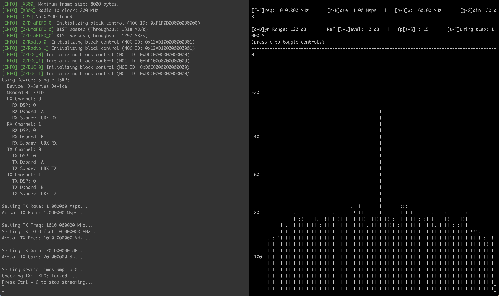

# Sounding Assignment

In this assignment, we will leverage CaST [[1]](#cite1) [[2]](#cite2), a toolchain for scenario creation and validation, to perform channel sounding of a Colosseum scenario (in this case [Test Scenario All Paths 0 dB (1009)](https://colosseumwireless.readthedocs.io/en/latest/scenarios/test_scenarios.html#all-paths-0-db-1009)). The toolchain uses GNU Radio, a free & open-source software development toolkit, to transmit and receive signals, and can use either Python or Matlab scripts to post-process the data.

## Make a reservation on Colosseum

1. Connect to Colosseum VPN (instructions [here](https://colosseumwireless.readthedocs.io/en/latest/getting_started/cisco_anyconnect_remote_vpn_access.html) and login to [Colosseum website](https://experiments.colosseum.net)).
2. Make a reservation with two SRNs with the `cast` common image and check the **"Octoclock"** flag (see instructions on [Making a Reservation](https://colosseumwireless.readthedocs.io/en/latest/reservations/making_a_reservation_interactive_and_batch_mode.html)).
Call the reservation in a meaningful way (e.g., your name). Two hours should suffice.
3. On the reservation page, you can find the assigned SRNs/nodes and their hostnames by hovering over nodes.
At your scheduled reservation time, open two terminals and ssh as `root` user into the assigned Colosseum SRNs: `ssh root@<srn-hostname>` (The password for the `cast` container is `cast123`).

## Verify the RF emulator is setup properly

In this step, we will verify that Colosseum RF emulator has been setup correctly.

1. Execute the `test_tx.sh` script in one onde, and the `test_rx.sh` in the second one.
This will flash the radio, and send a tone at a set frequency (1.01 GHz in this example) from the first SRN and it will display a spectrum analyzer in the second SRN.
If the RF emulator is set appropriately as explained in the previous section, the signal generated by the first SRN (left terminal in the figure below) will propagate through Colosseum RF emulator and reach the second SRN (right terminal).
The results should look similar to: <br /><br /> 

2. Hit `Ctrl+C` in both terminals to stop the `test_tx.sh` and `test_rx.sh` example scripts.

## Run CaST channel sounder

To run CaST channel sounding, users can simply leverage the step-by-step interactive bash script that will guide them to input all needed configurations and requirements for the sounder to perform its operations. It is recommended the use of terminal multiplexers like `tmux` or `screen` to avoid unwanted disconnections.

### Run the transmitter node

The transmitter (tx) node can be run by executing:
  ```
  cd /root
  tmux
  ./cast_tx.sh
  ```
The script will prompt a few configuration questions for the tx node to start transmitting. For the purpose of this assignment, the answers can be as follows:

1. What is the scenario frequency in Hz to sound (should be the same as the rx node)?:
   1. 1000000000

The script will flash the USRP and will start transmitting cyclically a code sequence at the specified frequency, in our case 1 GHz.

### Run the receiver node

The receiver (rx) node can be run by executing:
  ```
  cd /root
  tmux
  ./cast_rx.sh
  ```
As for the transmitter node, the script will prompt some configuration questions for the rx node to start receiving and for the data post-processing operations. For the purpose of this assignment, the answers can be as follows:

1. What is the scenario ID to sound?:

   1009
2. What is the scenario frequency in Hz to sound?:

   1000000000
3. What is the total number of nodes in the scenario?:

   10
4. What is the SRN node ID of the reservation acting as the tx (e.g. 3)?:

   < Tx-SRN-node-id-of-your-reservation >
5. Is the tx node running with the same frequency (y/n)?:

   yes
6. What is the desired sounding duration in seconds?:

   2
7. What is the scenario link tx-rx to sound (e.g. 1-2)?:

   1-2

In this way, the script will perform the following actions:
- Flash the USRP;
- Start scenario 1009;
- Start the receiver node;
- Sound the scenario link 1-2 for 2 seconds;
- Perform the post-processing operations in Python.

### Post-process the data

The data post-processing with Python is performed automatically by the rx node. After a few minutes, the script should return an output similar to this:
  ```
Performing sounding operations.
Mean: -59.33978 dB ### Min: -59.37658 dB ### Max: -59.29592 dB ### SD: 0.01232 dB
CaST sounding completed.
  ```
This tells us that the average pathloss of the link we have just sounded is around 59.63 dB. This value is called Colosseum base loss and represents the base loss that the Colosseum hardware-in-the-loop and emulation operations introduce in the system when sounding at 1 GHz. A value in the range of -55 and -65 dB is expected. It is worth noting that, even with the Colosseum base loss, the system is able to emulate various networks with no issues.

Moreover, you can download the results folder on your local computer which contains plots and more results information. The results folder will be renamed with a timestamp id. You can retrieve the name of the folder by running `ls` in the root directory:
  ```
root@gladiators-cast-srn39:~# ls /root
LICENSE  README.md  cast_rx.sh  cast_tx.sh  logs  radio_api  results_1009_1-2_2023_06_01-19_50
  ```
In this case, the result folder is named: `results_1009_1-2_2023_06_01-19_50`, and the SRN used is 39. Then, you can download it on your local pc via, for example, `scp`:
  ```
  scp -r gladiators-039:/root/results_1009_1-2_2023_06_01-19_50 .
  ```
In the folder, you will find other plots regarding: channel impulse response derived from the auto-correlation of the signals (`single_frame.pdf`), pathloss information (`all_ptahs.pdf`, `all_1res_paths.pdf`), 3d power delay profile (`3dpdp.pdf`), csv files (e.g. `path_info.csv` containing the same info printed out in the SRN rx terminal), and the raw data and results.

Additionally, data can be post-processed using Matlab, which gives more flexibility on more complex scenarios. In order to do this, you should download the Matlab scripts from the rx node to the local computer.

To download the Matlab files, you can use scp as follows (choose the right SRN number, e.g., 39 in this case):
  ```
scp -r gladiators-039:/root/radio_api/matlab .
  ```
To post-process the data with Matlab, you need to:
- Copy the results folder downloaded before (e.g., `results_1009_1-2_2023_06_01-19_50`) inside the Matlab directory just downloaded.

  Note that, if the post-processing in Python is not yet finished, the results folder can still be downloaded and will be called `results`.
- Open with Matlab the main script called: `channelEstimateCaST.m`.
- Between lines 16 and 32 there are several parameters that can be set. For this assignment, just modify line 16 with the name of the result folder, e.g.
   ```
   folder_data = "results_1009_1-2_2023_06_01-19_50";   % Name of the data folder where the raw data are
   ```
- Run the script.

Matlab should plot similar results as Python, showing the pathloss information of the first stronger tap and the 3d power delay profile.


## Optional: Sounding more complex scenarios

In the previous case, we have sounded the [Test Scenario All Paths 0 dB (1009)](https://colosseumwireless.readthedocs.io/en/latest/scenarios/test_scenarios.html#all-paths-0-db-1009), which is just single tap and with a nominal loss of 0 dB. However, CaST is able to sound more complex scenarios, e.g., multi-taps and mobile.

You can first try to sound fixed pathloss scenarios to check how the results would change with different pathlosses (Reference: [Fixed Pathloss Scenarios (51000-51100)](https://colosseumwireless.readthedocs.io/en/latest/scenarios/fixed_pathloss_scenarios.html#scenarios-51000-51100)):
- Scenario 51005 with any link: 5 dB pathloss.
- Scenario 51015 with any link: 15 dB pathloss.

Moreover, during the development of CaST, different Channel Sounding Scenarios have been created to test its capabilities, which can be found here: [Channel Sounding Scenarios (90000-90100)](https://colosseumwireless.readthedocs.io/en/latest/scenarios/channel_sounding_scenarios.html). You can try to sound the following scenario links for more meaningful results:
- Scenario 90002 with link 1-2
- Scenario 90001 with link 4-5;
- Scenario 90001 with link 3-4;

A complete list of Colosseum scenarios with their corresponding information available for all users can be found here: [Scenario Summary List](https://colosseumwireless.readthedocs.io/en/latest/scenarios/index.html).


## Clean up

This concludes Colosseum Sounding assignment. After you are done with your experiments, it is good practice to stop the traffic and RF scenarios by running the following command from within one of the SRN containers and to terminate your reservation from the Colosseum portal:
- `colosseumcli tg stop`
- `colosseumcli rf stop`
- In all terminals, close your ssh connections by typing: `exit`
- Access the Colosseum portal and delete your reservation.


# References

<a id="cite1">[1]</a>  D. Villa, M. Tehrani-Moayyed, P. Johari, S. Basagni, T. Melodia, "CaST: A Toolchain for Creating and Characterizing Realistic Wireless Network Emulation Scenarios", Proc. of the 16th ACM Workshop on Wireless Network Testbeds, Experimental evaluation & CHaracterization (WiNTECH 2022), Sydney, Australia, October 2022. [[Paper]](https://ece.northeastern.edu/wineslab/papers/villa2022wintech.pdf)

<a id="cite2">[2]</a> https://www.github.com/wineslab/cast/